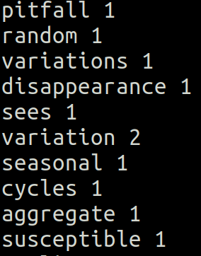
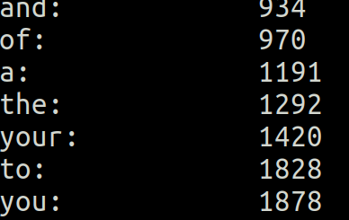
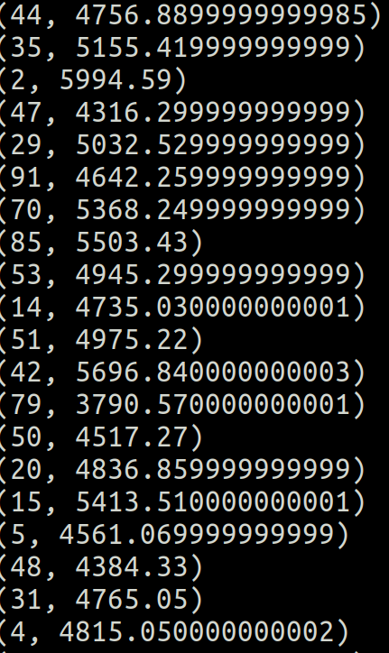

# 2- Spark Basics and the RDD Interface

1. [Key/ Value RDD'S](#schema1)
2. [Filtering RDD'S](#schema2)
3. [map VS. flatmap](#schema3)
4. [Text normalization with Regex](#schema4)
5. [Total spent by customer](#schema5)

# 1. Key / Value RDD'S

Vamos analizar la media de amigos por edad y para eso tenemos que ejecutar el archivo friends-by-age.py

1º cargamos el archivo fakefriend.csv
~~~ python
lines = sc.textFile("./data/fakefriends.csv")
~~~

2º Creamos RDD pero haciendo un map a los datos con la función parseline

~~~ python

rdd = lines.map(parseLine)

def parseLine(line):
    fields = line.split(',')
    age = int(fields[2])
    numFriends = int(fields[3])
    return (age, numFriends)
~~~ 
3º Creamos una variable con los totales por la edad `totalsByAge`, para ello usamos las acciones mapValues(func) y reduceByKey(func)

*mapValues(func)* crea un nuevo RDD de pares clave/valor, resultado de aplicar únicamente sobre los valores la función func, que recibe un solo parámetro.
*reduceByKey(func)* devuelve un RDD de pares clave/valor, donde cada clave única se corresponde con las diferentes claves del RDD original, y el valor es el resultado de aplicar una operación reduce sobre los valores correspondientes a una misma clave.

~~~ python
totalsByAge = rdd.mapValues(lambda x: (x, 1)).reduceByKey(lambda x, y: (x[0] + y[0], x[1] + y[1]))
~~~
4º Obtenemos las medias de las edades.

~~~python
averagesByAge = totalsByAge.mapValues(lambda x: round(x[0] / x[1],2))
results = averagesByAge.collect()
for result in results:
    print(result)
~~~

# 2.Filtering RDD'S
Vamos a obtener la temperatura mínima obsevada por cada estación metereológica.

1º cargamos el archivo fakefriend.csv
~~~ python
lines = sc.textFile("./data/1800.csv")
~~~

2º Creamos RDD pero haciendo un map a los datos con la función parseline

~~~ python

rdd = lines.map(parseLine)

def parseLine(line):
    fields = line.split(',')
    stationID = fields[0]
    entryType = fields[2]
    temperature = float(fields[3]) * 0.1 * (9.0 / 5.0) + 32.0
    return (stationID, entryType, temperature)

~~~ 

3º Creamos una variable`minTemps` dondes solo vamos a guardar los valores que estén filtrados por el valor  `TMIN`
~~~ python
minTemps = parsedLines.filter(lambda x: "TMIN" in x[1])
~~~
*filter(func)* retorna un nuevo RDD que solo contiene los elementos del RDD original que satisfacen el predicado especificado en la función func (que retornará True o False)

4º Obtenemos `stationTemps` que cogemos sólo los valores de la posición 0 y 2 del la varible `minTemps` y reducimos los valores por lo que tengan el valor mínimo y por último imprimimos los resultados

~~~ python
stationTemps = minTemps.map(lambda x: (x[0], x[2]))
minTemps = stationTemps.reduceByKey(lambda x, y: min(x,y))
results = minTemps.collect()

for result in results:
    print(result[0] + "\t{:.2f}F".format(result[1]))
~~~

Como ejericio hemos creado obtenido el valor máximo.

Sólo hemos cambiado estas líneas
~~~ python
maxTemps = parsedLines.filter(lambda x: "TMAX" in x[1])

stationTemps = maxTemps.map(lambda x: (x[0], x[2]))
maxTemps = stationTemps.reduceByKey(lambda x, y: max(x,y))
results = maxTemps.collect()

~~~

# 3. map VS. flatmap

Vamos a ver las diferencias entre map y flatmap

`map(func)` retorna un nuevo RDD, resultado de pasar cada uno de los elementos del RDD original como parámetro de la función func.

`flatMap(func)` es similar a map(func) pero en caso de que func retorne una lista o tupla, esta no será mapeada directamente en el RDD resultante, sino que se mapearán individualmente los elementos contenidos.

Ahora vamos a contar cuantas palabras hay en un texto y cuantas veces se repite esa palabra.

1º cargamos el archivo fakefriend.csv
~~~ python
input = sc.textFile("./data/book.txt")
~~~

2º aplicamos a `input` la función flatmap para obtener en un array cada palabra por separdo y contamos las veces que esa palabra aparece con `countByValue()`

~~~ python
words = input.flatMap(lambda x: x.split())
wordCounts = words.countByValue()
~~~

3º imprimimos el resultado
~~~ python
for word, count in wordCounts.items():
    cleanWord = word.encode('ascii', 'ignore')
    if (cleanWord):
        print(cleanWord.decode() + " " + str(count))
~~~

# 4. Text normalization with Regex  and sorted

1º Importamos librería de expresiones regulares
~~~ python
import re
~~~
2º Creamos función en la que busca todas las palabras que se ajustan a la expresión regular y las pone en minúscula 
~~~python
def normalizeWords(text):
    return re.compile(r'\W+', re.UNICODE).split(text.lower())

input = sc.textFile("./data/book.txt")
words = input.flatMap(normalizeWords)
wordCounts = words.countByValue()

~~~
3º Imprimos el resultado

4º Ordenamos por mayor número. 

~~~ python
wordCounts = words.map(lambda x: (x, 1)).reduceByKey(lambda x, y: x + y)
wordCountsSorted = wordCounts.map(lambda x: (x[1], x[0])).sortByKey()
results = wordCountsSorted.collect()

~~~
5º Imprimos el resultado

# 5. Total spent by customer
1º importamos las librerias de pyspark y creamos la conf

~~~ python
from pyspark import SparkConf, SparkContext

conf = SparkConf().setMaster("local").setAppName("SpendByCustomer")
sc = SparkContext(conf = conf)
~~~

2º Creamos la función que va a separar los valores por las comas
~~~ python
def extractCustomerPricePairs(line):
    fields = line.split(',')
    return (int(fields[0]), float(fields[2]))
~~~

3º Cargamos el archivo `customer-order.csv`
~~~python
input = sc.textFile("./data/customer-orders.csv")
~~~
4º Hacemos el mapeo del archivo `input` con la función `extractCustomerPricePairs` y creamos `totalByCustomer`con la función `reduceBykey`.

~~~python
mappedInput = input.map(extractCustomerPricePairs)
totalByCustomer = mappedInput.reduceByKey(lambda x, y: x + y)
~~~
5º Obtenemos los resultados y los imprimos.
~~~ python
results = totalByCustomer.collect()
for result in results:
    print(result)
~~~

